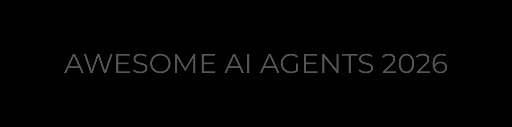

# Awesome AI Agents 2026

The most comprehensive, structured guide to AI agent frameworks, tools, and resources. Updated weekly. Compared side-by-side. Built for developers who ship.

## Contents

- [Orchestration Frameworks](#orchestration-frameworks)
- [Coding Agents](#coding-agents)
- [Memory and Context](#memory-and-context)
- [Multi-Agent Systems](#multi-agent-systems)
- [Agent Communication Protocols](#agent-communication-protocols)
- [Browser and Computer Use Agents](#browser-and-computer-use-agents)
- [Agent Tooling and Infrastructure](#agent-tooling-and-infrastructure)
- [Low and No-Code Builders](#low-and-no-code-builders)
- [Voice and Multimodal Agents](#voice-and-multimodal-agents)
- [Safety Guardrails and Observability](#safety-guardrails-and-observability)
- [Agent Deployment and Hosting](#agent-deployment-and-hosting)
- [Agent Evaluation and Benchmarks](#agent-evaluation-and-benchmarks)
- [Learning Resources](#learning-resources)
- [Modern AI System](#modern-ai-system)
- [Changelog](#changelog)
- [Star History](#star-history)

## Orchestration Frameworks

The core frameworks for building, orchestrating, and running AI agents.

> **How to choose:** Need enterprise compliance? Semantic Kernel, LangGraph. TypeScript shop? Mastra, VoltAgent, Vercel AI SDK. Just getting started? CrewAI, PydanticAI, OpenAI Agents SDK.

| Framework       | Language       | Multi-Agent | Memory | MCP | Stars |
| --------------- | -------------- | ----------- | ------ | --- | ----- |
| LangGraph       | Python         | Yes         | Yes    | Yes | ~12k  |
| CrewAI          | Python         | Yes         | No     | Yes | ~41k  |
| AutoGen         | Python         | Yes         | Yes    | Yes | ~52k  |
| PydanticAI      | Python         | No          | No     | Yes | ~8k   |
| Mastra          | TypeScript     | Yes         | Yes    | Yes | ~8k   |
| Semantic Kernel | Python/C#/Java | Yes         | Yes    | Yes | ~22k  |

- [Agno](https://github.com/agno-agi/agno) - Multi-agent framework with a runtime and control plane for managing agent deployments at scale.
- [AutoGen](https://github.com/microsoft/autogen) - Event-driven multi-agent framework merged with Semantic Kernel for production workflows.
- [CrewAI](https://github.com/crewAIInc/crewAI) - Role-playing agent orchestration for collaborative agent teams.
- [Google ADK](https://github.com/google/adk-python) - Modular agent dev kit integrating Gemini and Vertex AI natively.
- [Haystack](https://github.com/deepset-ai/haystack) - Production-ready AI orchestration framework focused on building customizable LLM applications and RAG pipelines.
- [LangGraph](https://github.com/langchain-ai/langgraph) - Enterprise framework for stateful, graph-based agent workflows.
- [Letta](https://github.com/letta-ai/letta) - Formerly MemGPT. Stateful agents with built-in long-term memory and a REST API server.
- [LlamaIndex](https://github.com/run-llama/llama_index) - The leading framework for connecting LLMs to your data, with powerful indexing and retrieval capabilities.
- [Mastra](https://github.com/mastra-ai/mastra) - Opinionated TypeScript framework with RAG, observability, and MCP support built in.
- [Modus](https://github.com/hypermodeinc/modus) - Serverless framework for high-throughput agent workloads with minimal cold starts.
- [OpenAI Agents SDK](https://github.com/openai/openai-agents-python) - Lightweight multi-agent SDK with tracing and guardrails from OpenAI.
- [Open-AutoGLM](https://github.com/zai-org/Open-AutoGLM) - Open-source phone agent model and framework for building mobile device automation agents.
- [PraisonAI](https://github.com/MervinPraison/PraisonAI) - Production multi-agent framework with self-reflection, MCP integration, and workflow automation.
- [PydanticAI](https://github.com/pydantic/pydantic-ai) - Type-safe agent framework from the Pydantic team with a FastAPI-style developer experience.
- [Semantic Kernel](https://github.com/microsoft/semantic-kernel) - Microsoft enterprise SDK for Python, C#, and Java with modular plugins, memory, and goal planning.
- [Smolagents](https://github.com/huggingface/smolagents) - Hugging Face code-first framework where agents write and execute Python instead of JSON tool calls.
- [Strands Agents SDK](https://github.com/strands-agents/sdk-python) - AWS model-driven agent SDK with native Bedrock integration.
- [Vercel AI SDK](https://github.com/vercel/ai) - Streaming-first primitives for AI UIs with React Server Components and edge runtime support.
- [VoltAgent](https://github.com/voltagent/voltagent) - TypeScript agent framework with built-in observability and a self-improving context engine.

## Coding Agents

AI-powered tools that write, edit, debug, and ship code from terminal pair programmers to full autonomous software engineers.

> **How to choose:** Want terminal-first? Aider, Claude Code, gemini-cli. IDE-integrated? Cline, Continue, Cursor. Full autonomy? OpenHands, SWE-agent, Devin.

| Agent       | Type       | Open Source | Interface | Best For                   |
| ----------- | ---------- | ----------- | --------- | -------------------------- |
| Aider       | Terminal   | Yes         | CLI       | Git-aware pair programming |
| Claude Code | Terminal   | Yes         | CLI       | Multi-file edits + tests   |
| gemini-cli  | Terminal   | Yes         | CLI       | Google ecosystem           |
| Codex CLI   | Terminal   | Yes         | CLI       | Fast autonomous tasks      |
| Cline       | IDE        | Yes         | VS Code   | Permission-gated editing   |
| Continue    | IDE        | Yes         | VS Code   | CI-enforceable checks      |
| Cursor      | IDE        | No          | Desktop   | Deep codebase refactoring  |
| Windsurf    | IDE        | No          | Desktop   | Team collaboration         |
| Devin       | Autonomous | No          | Cloud     | End-to-end engineering     |
| OpenHands   | Autonomous | Yes         | Web       | Full dev lifecycle         |

- [Aider](https://github.com/Aider-AI/aider) - Terminal-first pair programmer that edits code in local repos, preserves Git history, and supports multi-file changes.
- [AutoGPT](https://github.com/Significant-Gravitas/AutoGPT) - Mature autonomous agent platform with Forge framework and public benchmarks for evaluating agent capabilities.
- [Claude Code](https://github.com/anthropics/claude-code) - Terminal-first agentic coding tool with multi-file edits, test running, and Git operations baked in.
- [Cline](https://github.com/cline/cline) - Autonomous coding agent in your IDE that creates/edits files, runs commands, and uses the browser with permission-gated steps.
- [Codex CLI](https://github.com/openai/codex) - OpenAI's lightweight, open-source terminal coding agent with fast execution and strong benchmark scores.
- [Codex-CLI](https://github.com/microsoft/Codex-CLI) - CLI tool that turns natural language commands into Bash, ZShell, and PowerShell equivalents.
- [Continue](https://github.com/continuedev/continue) - Source-controlled AI checks enforceable in CI, powered by the open-source Continue CLI.
- [Cursor](https://cursor.com) - AI-native IDE (VS Code fork) with deep codebase awareness, multi-file refactoring, and agentic workflows.
- [Devin](https://devin.ai) - Fully autonomous AI software engineer that plans, codes, tests, and deploys in a cloud sandbox.
- [gemini-cli](https://github.com/google-gemini/gemini-cli) - Open-source AI agent that brings the power of Gemini directly into your terminal.
- [Goose](https://github.com/aaif-goose/goose) - Open-source extensible AI agent that goes beyond code suggestions, installs, executes, edits, and tests with any LLM.
- [Open Interpreter](https://github.com/openinterpreter/open-interpreter) - Execute code locally via natural-language model instructions with a ChatGPT-like interface.
- [opencode](https://github.com/anomalyco/opencode) - Open-source coding agent available as a desktop application with a visual interface.
- [OpenHands](https://github.com/OpenHands/OpenHands) - AI-driven development platform that writes, tests, and deploys code autonomously.
- [SWE-agent](https://github.com/SWE-agent/SWE-agent) - Takes a GitHub issue and tries to automatically fix it. Also used for cybersecurity and competitive coding.
- [Windsurf](https://windsurf.com) - AI-native IDE with Cascade agent for multi-step autonomous tasks and team workflows.

## Memory and Context

Persistent memory, knowledge graphs, and context management for agents that need to remember, learn, and adapt.

> **How to choose:** Need plug-and-play memory? Mem0. Knowledge graphs? graphiti, cognee. Video/document retrieval? Memvid. Full-stack solution? Cortex Memory.

| Solution    | Approach        | Graph Support | Multi-Modal | Stars |
| ----------- | --------------- | ------------- | ----------- | ----- |
| Mem0        | Hybrid          | No            | No          | ~30k  |
| graphiti    | Knowledge Graph | Yes           | No          | ~4k   |
| cognee      | Graph + Vector  | Yes           | No          | ~3k   |
| Supermemory | Vector          | No            | No          | ~7k   |
| Memvid      | Video-based     | No            | Yes         | ~4k   |

- [Acontext](https://github.com/memodb-io/Acontext) - Manages agent skills and long-term memory as a layered data structure for persistent context.
- [cognee](https://github.com/topoteretes/cognee) - Knowledge engine for AI agent memory, set up in 6 lines of code with graph-based knowledge extraction.
- [Cortex Memory](https://github.com/prem-research/cortex) - Full-stack solution for agent memory covering extraction, vector search, and optimization.
- [graphiti](https://github.com/getzep/graphiti) - Build real-time knowledge graphs for AI agents with automatic entity extraction and linking.
- [Langmem](https://github.com/langchain-ai/langmem) - Helps agents learn and adapt from their interactions over time with persistent memory.
- [Mem0](https://github.com/mem0ai/mem0) - Memory layer for AI applications with long-term, short-term, and semantic memory extraction.
- [Memvid](https://github.com/memvid/memvid) - Replace complex RAG pipelines with a serverless, single-file memory layer for instant retrieval.
- [SimpleMem](https://github.com/aiming-lab/SimpleMem) - Efficient lifelong memory for LLM agents supporting both text and multimodal inputs.
- [Supermemory](https://github.com/supermemoryai/supermemory) - Extremely fast and scalable memory engine and API designed for the AI era.

## Multi-Agent Systems

Frameworks specifically designed for orchestrating multiple agents working together on shared objectives.

> **How to choose:** Need a quick prototype? Swarm. Full software team simulation? MetaGPT. Production-scale orchestration? Swarms Framework. Research playground? AgentVerse.

- [AgentVerse](https://github.com/OpenBMB/AgentVerse) - Framework for building custom multi-agent environments to accomplish collaborative tasks.
- [EvoAgentX](https://github.com/EvoAgentX/EvoAgentX) - Evaluates and evolves agentic workflows over time using automatic optimization.
- [Hivemoot](https://github.com/hivemoot/hivemoot) - Autonomous agent teams that collaboratively build software on GitHub.
- [MetaGPT](https://github.com/FoundationAgents/MetaGPT) - Simulates a full software company workflow from requirements to PRs using role-playing agents.
- [Swarm](https://github.com/openai/swarm) - Lightweight framework for agent handoffs, context variables, and function calling patterns from OpenAI.
- [Swarms Framework](https://github.com/kyegomez/swarms) - Multi-agent orchestration for production use cases with scalability and reliability at its core.

## Agent Communication Protocols

The protocol layer that enables agents to discover tools, communicate with each other, and interoperate across ecosystems.

> **How to choose:** Connecting agents to tools? MCP. Agent-to-agent communication? A2A. Both? Use MCP for tools and A2A for coordination.

| Protocol | Purpose             | Creator   | Status   |
| -------- | ------------------- | --------- | -------- |
| MCP      | Agent-to-tool       | Anthropic | Standard |
| A2A      | Agent-to-agent      | Google    | Growing  |
| ACP      | Agent communication | IBM/BeeAI | Early    |

### MCP (Model Context Protocol)

- [Arcade AI](https://github.com/ArcadeAI/arcade-mcp) - Tool-use platform with authentication, authorization, and logging for agent-tool interactions.
- [Composio](https://github.com/ComposioHQ/composio) - Integration platform with 250+ pre-built tool connectors for AI agents and LLMs.
- [Docker MCP](https://github.com/docker/docker-mcp) - Docker's MCP gateway CLI plugin for running MCP servers in isolated containers.
- [MCP Registry](https://github.com/modelcontextprotocol) - Official Model Context Protocol specification and server implementations for standardized tool access.
- [Toolhouse](https://toolhouse.ai) - Cloud-hosted tool infrastructure for agents with optimized execution and low-latency access.
- [Zapier MCP Server](https://zapier.com/mcp) - Connect agents to 7,000+ app integrations via MCP, powered by Zapier's automation platform.

### A2A (Agent-to-Agent Protocol)

- [A2A Protocol](https://github.com/google/A2A) - Google's open protocol enabling AI agents to communicate, collaborate, and delegate tasks across frameworks.

## Browser and Computer Use Agents

Agents that navigate the web, interact with UIs, and automate computer tasks.

> **How to choose:** Need Playwright-based reliability? Stagehand. Vision-based generalization? Skyvern. Full browser control? Browser Use. Web scraping? AgentQL.

| Agent       | Approach        | Base         | Stars |
| ----------- | --------------- | ------------ | ----- |
| Browser Use | LLM navigation  | Playwright   | ~30k  |
| Stagehand   | NL selectors    | Playwright   | ~11k  |
| Skyvern     | Computer vision | Custom       | ~11k  |
| LaVague     | Action model    | Selenium     | ~6k   |
| AgentQL     | Semantic query  | Custom       | ~2k   |

- [AgentQL](https://github.com/tinyfish-io/agentql) - AI-powered web scraping and automation with a semantic query language for page elements.
- [Browser Use](https://github.com/browser-use/browser-use) - Open-source framework to let LLMs navigate and interact with any website programmatically.
- [LaVague](https://github.com/lavague-ai/LaVague) - Large Action Model framework to turn natural language instructions into browser automation.
- [Skyvern](https://github.com/Skyvern-AI/skyvern) - Automate browser-based workflows with computer vision and LLMs, no brittle selectors needed.
- [Stagehand](https://github.com/browserbase/stagehand) - AI web browsing framework built on Playwright with natural-language selectors and actions.

## Agent Tooling and Infrastructure

Sandboxes, web scrapers, browser automation, and networking layers that agents depend on.

> **How to choose:** Need code sandboxing? E2B. Web scraping for LLMs? Firecrawl. Full agent deployment? AgentDock.

- [AgentDock](https://github.com/agentdock/agentdock) - Framework for building and deploying production-ready AI agents with composable node architecture.
- [E2B](https://github.com/e2b-dev/e2b) - Cloud sandboxes for AI agents to run code securely in isolated environments.
- [Engram](https://github.com/kwstx/engram_translator) - Universal bridge for multi-protocol AI agent systems with automated semantic mapping.
- [Firecrawl](https://github.com/firecrawl/firecrawl) - Web scraping API built for LLMs that converts websites to clean, structured markdown.
- [KubeStellar Console](https://github.com/kubestellar/console) - Multi-cluster Kubernetes dashboard with MCP bridge enabling AI agents to manage workloads across edge and cloud clusters.
- [Notte](https://github.com/nottelabs/notte) - Browser automation engine optimized for production AI pipelines.
- [Pilot Protocol](https://github.com/TeoSlayer/pilotprotocol) - Networking stack for distributed agent systems with encrypted tunnels.

## Low and No-Code Builders

Visual and browser-based tools for building agents without writing code.

> **How to choose:** Need full RAG orchestration? Dify. Drag-and-drop pipelines? Langflow. Zero-setup browser agent? AgentGPT.

- [AgentGPT](https://github.com/reworkd/AgentGPT) - Deploy AI agents in the browser with zero local setup required.
- [Dify](https://github.com/langgenius/dify) - Open-source LLM app development platform with visual workflow builder and RAG orchestration.
- [Langflow](https://github.com/langflow-ai/langflow) - Visual drag-and-drop builder for LLM workflows, RAG agents, and multi-step pipelines.

## Voice and Multimodal Agents

Frameworks for building agents that can hear, speak, see, and interact across modalities.

> **How to choose:** Need real-time voice? LiveKit Agents, Vapi. Streaming pipelines? Pipecat. Multimodal RAG? Agentset.

- [Agentset](https://github.com/agentset-ai/agentset) - Production RAG platform with reasoning, hybrid search, and full multimodal support.
- [LiveKit Agents](https://github.com/livekit/agents) - Framework for building real-time, multimodal AI agents with voice, video, and data channels.
- [Pipecat](https://github.com/pipecat-ai/pipecat) - Open-source framework for voice and multimodal conversational AI with streaming pipelines.
- [Vapi](https://github.com/VapiAI/server-sdk-python) - Platform for building voice AI agents with low-latency speech-to-speech capabilities.

## Safety Guardrails and Observability

Tools for governing, monitoring, and securing autonomous AI agents in production.

> **How to choose:** Need full observability? Langfuse, Arize Phoenix. Runtime guardrails? AgentGuard, AgentDoG. Python-native monitoring? Logfire.

- [Agent OS](https://github.com/buildermethods/agent-os) - Kernel architecture for governing autonomous AI agents with policy enforcement.
- [AgentDoG](https://github.com/AI45Lab/AgentDoG) - Diagnostic guardrails that analyze full agent execution trajectories to detect instruction hijacking and tool misuse.
- [AgentGuard](https://github.com/cyberark/agent-guard) - Runtime observability and guardrails for AI agents with loop detection and anomaly alerts.
- [APort Agent Guardrails](https://github.com/aporthq/aport-agent-guardrails) - Pre-action authorization plugin for agent frameworks with policy-based access control.
- [Arize Phoenix](https://github.com/Arize-ai/phoenix) - Open-source observability platform built on OpenTelemetry for tracing, evaluating, and debugging AI agents.
- [DriftGuard](https://github.com/sujal-maheshwari2004/DriftGuard) - Semantic memory guardrails using causal graphs to prevent agents from repeating past failures.
- [Laminar](https://github.com/lmnr-ai/lmnr) - Open-source observability and analytics platform purpose-built for the full lifecycle of AI agents.
- [Langfuse](https://github.com/langfuse/langfuse) - Open-source LLM observability platform for tracing, prompt versioning, and LLM-as-a-judge evaluations.
- [Logfire](https://github.com/pydantic/logfire) - Python-native observability from the Pydantic team with deep integration for high-performance agent monitoring.
- [Orchard Kit](https://github.com/OrchardHarmonics/orchard-kit) - Modules for agent runtime security, self-audit trails, and collective cognition patterns.

## Agent Deployment and Hosting

Platforms and tools for deploying, scaling, and hosting AI agents in production.

> **How to choose:** Need serverless GPU? Modal. AWS-native? Bedrock AgentCore. Git-push deploy? Railway, Northflank. Background jobs? Trigger.dev.

- [AWS Bedrock AgentCore](https://github.com/awslabs/agentcore-samples) - Managed AWS infrastructure for Bedrock-based agents with compliance, scaling, and monitoring built in.
- [Modal](https://github.com/modal-labs/modal-client) - Serverless GPU compute purpose-built for AI workloads with fast cold starts and Python-native deployment.
- [Northflank](https://northflank.com/) - Full-stack platform with GPU orchestration, Git-based CI/CD, and bring-your-own-cloud support.
- [Railway](https://railway.com/) - One-click deploy from GitHub with persistent volumes and databases for stateful agent deployments.
- [Trigger.dev](https://github.com/triggerdotdev/trigger.dev) - Background job platform with cron, webhook, and event triggers purpose-built for long-running agent tasks.

## Agent Evaluation and Benchmarks

If you are building agents, you need to measure them. These tools help you evaluate, score, and compare agent performance.

> **How to choose:** Evaluating coding agents? SWE-bench. General reasoning? GAIA. Multi-environment testing? AgentBench. Custom evals? Inspect AI.

- [AgentBench](https://github.com/THUDM/AgentBench) - Comprehensive benchmark for evaluating LLMs as agents across 8 distinct environments.
- [GAIA Benchmark](https://huggingface.co/papers/2311.12983) - Benchmark for General AI Assistants measuring real-world reasoning and tool use.
- [Inspect AI](https://github.com/UKGovernmentBEIS/inspect_ai) - Framework for evaluating large language models with composable tasks and scoring.
- [SWE-bench](https://github.com/SWE-bench/SWE-bench) - Benchmark for evaluating LLMs on real-world software engineering tasks from GitHub issues.

## Learning Resources

Courses, papers, and guides for understanding AI agents.

- [AI Agents in LangGraph](https://www.deeplearning.ai/short-courses/ai-agents-in-langgraph/) - Short course on building production agents with LangGraph by Andrew Ng's platform.
- [AgentBench: Evaluating LLMs as Agents](https://arxiv.org/abs/2309.07864) - The benchmark paper for evaluating LLMs as agents across diverse environments.
- [Building Effective Agents](https://www.anthropic.com/engineering/building-effective-agents) - Anthropic's guide on agent design patterns, evaluation strategies, and production best practices.
- [LLM Powered Autonomous Agents](https://lilianweng.github.io/posts/2023-06-23-agent/) - Deep breakdown of LLM-powered agent components: planning, memory, and tool use.
- [Prompt Engineering Guide](https://github.com/dair-ai/Prompt-Engineering-Guide) - Community-maintained guide covering prompt engineering techniques and agent strategies.
- [ReAct: Synergizing Reasoning and Acting in Language Models](https://arxiv.org/abs/2210.03629) - The foundational paper behind the ReAct prompting pattern used in most agent frameworks.

## Modern AI System

> A high-level architecture view of how modern AI agent systems are structured from foundation models to orchestration layers, memory, tools, and deployment.

## Changelog

See [CHANGELOG.md](CHANGELOG.md) for the full update history.

## Contributing

Your contributions are what keep this list useful. Read [Contributing.md](Contributing.md) for the entry format, inclusion criteria, and style guide.

## Star History

