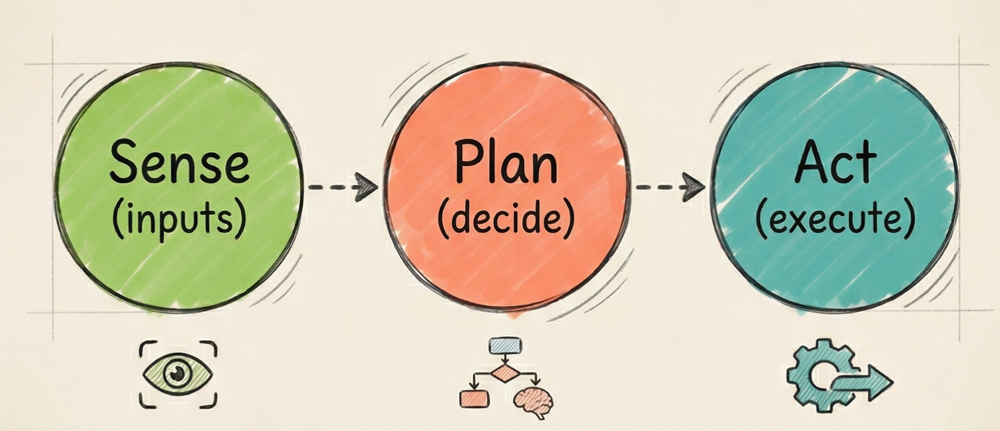
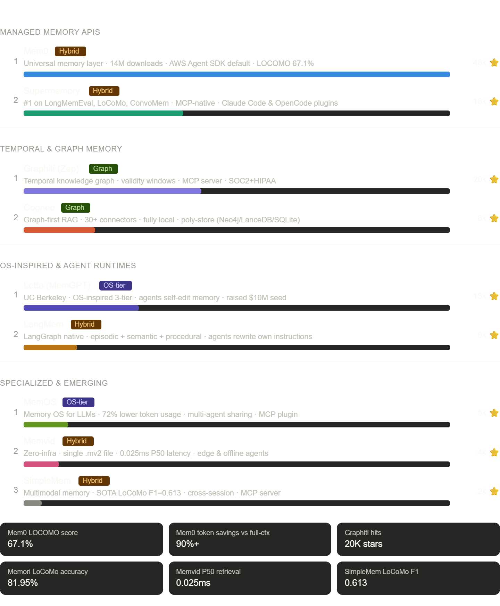
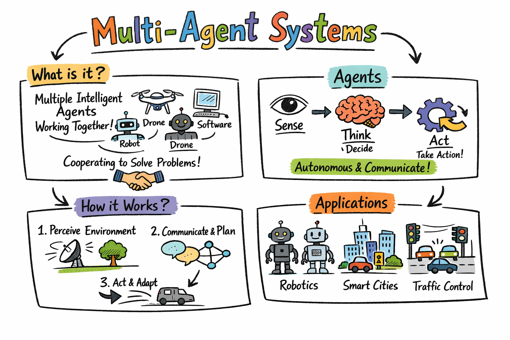
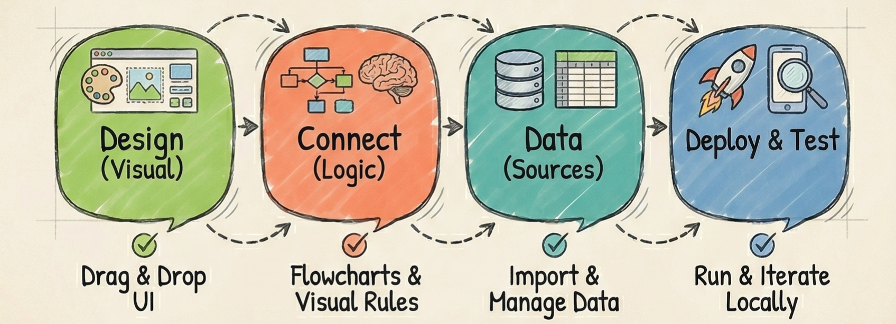
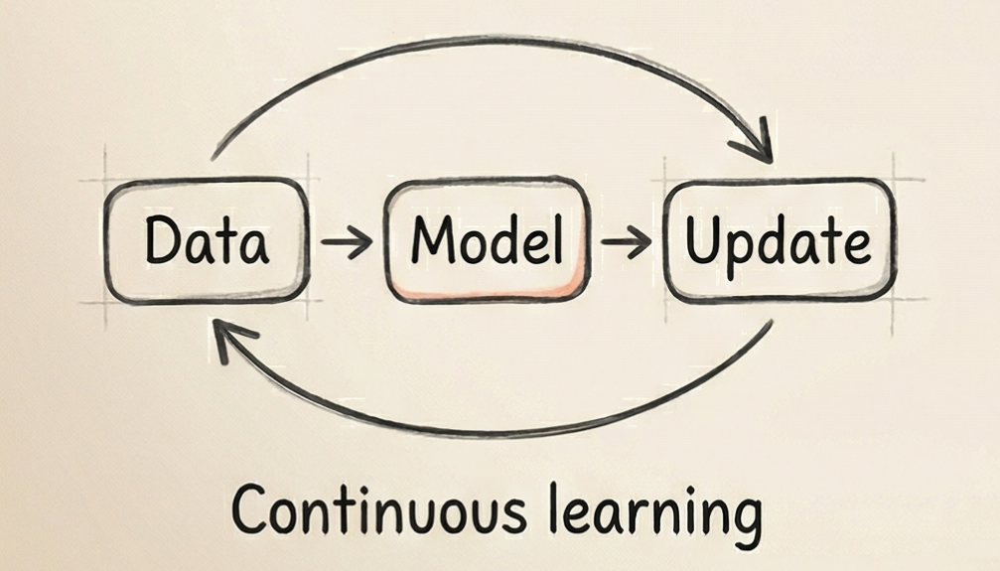

# 🤖 Awesome AI Agents 2026

**The most comprehensive, structured guide to AI agent frameworks, tools, and resources.**
**Updated weekly · Compared side-by-side · Built for developers who ship.**

[Frameworks](#orchestration-frameworks) · [Coding Agents](#coding-agents) · [Memory](#memory-and-context) · [Multi-Agent](#multi-agent-systems) · [MCP & Tooling](#mcp-and-tool-protocols) · [Browser Agents](#browser-and-computer-use-agents) · [Contributing](Contributing.md)

---

## Why This List?

There are other AI agent lists. Here's what makes this one different:

- 🏷️ **Tagged & comparable** — every tool shows language, stars, and activity status
- 📊 **Comparison tables** — side-by-side matrices to help you choose the right tool
- 🗂️ **15 structured categories** — not a flat dump, a navigable taxonomy
- 🔄 **Updated weekly** — we verify links and star counts regularly
- 🧭 **Decision guides** — context to help you pick the right framework for your use case

> 💡 **If you find this useful, please [star this repo](https://github.com/ARUNAGIRINATHAN-K/awesome-ai-agents) — it helps others find it too!**

---

## Contents

- [Orchestration Frameworks](#orchestration-frameworks)
- [Coding Agents](#coding-agents)
- [Memory and Context](#memory-and-context)
- [Multi-Agent Systems](#multi-agent-systems)
- [MCP and Tool Protocols](#mcp-and-tool-protocols)
- [Browser and Computer Use Agents](#browser-and-computer-use-agents)
- [Agent Tooling and Infrastructure](#agent-tooling-and-infrastructure)
- [Low and No-Code Builders](#low-and-no-code-builders)
- [Voice and Multimodal Agents](#voice-and-multimodal-agents)
- [Safety Guardrails and Observability](#safety-guardrails-and-observability)
- [Agent Deployment and Hosting](#agent-deployment-and-hosting)
- [Agent Evaluation and Benchmarks](#agent-evaluation-and-benchmarks)
- [Learning Resources](#learning-resources)
- [Modern AI system](#modern-ai-system)

---

## Orchestration Frameworks

The core frameworks for building, orchestrating, and running AI agents.

> **How to choose:** Need enterprise compliance? → Semantic Kernel, LangGraph. TypeScript shop? → Mastra, VoltAgent, Vercel AI SDK. Just getting started? → CrewAI, PydanticAI, OpenAI Agents SDK.

| Framework | Language | Multi-Agent | Memory | MCP | Stars |
|---|---|---|---|---|---|
| LangGraph | Python | ✅ | ✅ | ✅ | ~12k |
| CrewAI | Python | ✅ | ❌ | ✅ | ~41k |
| AutoGen | Python | ✅ | ✅ | ✅ | ~52k |
| PydanticAI | Python | ❌ | ❌ | ✅ | ~8k |
| Mastra | TypeScript | ✅ | ✅ | ✅ | ~8k |
| Semantic Kernel | Python/C#/Java | ✅ | ✅ | ✅ | ~22k |

- [Agno](https://github.com/agno-agi/agno) — Multi-agent framework with a runtime and control plane for managing agent deployments at scale. `Python` · ⭐ ~18k · 📅 Active
- [AutoGen](https://github.com/microsoft/autogen) — Event-driven multi-agent framework merged with Semantic Kernel for production workflows. `Python` · ⭐ ~52k · 📅 Active
- [CrewAI](https://github.com/joaomdmoura/crewAI) — Role-playing agent orchestration for collaborative agent teams. `Python` · ⭐ ~41k · 📅 Active
- [Google ADK](https://github.com/google/adk-python) — Modular agent dev kit integrating Gemini and Vertex AI natively. `Python` · ⭐ ~12k · 📅 Active
- [Haystack](https://github.com/deepset-ai/haystack) — Production-ready AI orchestration framework focused on building customizable LLM applications and RAG pipelines. `Python` · ⭐ ~20k · 📅 Active
- [LangGraph](https://github.com/langchain-ai/langgraph) — Enterprise framework for stateful, graph-based agent workflows. `Python` · ⭐ ~12k · 📅 Active
- [Letta](https://github.com/letta-ai/letta) — Formerly MemGPT — stateful agents with built-in long-term memory and a REST API server. *(Also in [Memory and Context](#memory-and-context))* `Python` · ⭐ ~15k · 📅 Active
- [LlamaIndex](https://github.com/run-llama/llama_index) — The leading framework for connecting LLMs to your data, with powerful indexing and retrieval capabilities. *(Also in [Memory and Context](#memory-and-context))* `Python` · ⭐ ~46k · 📅 Active
- [Mastra](https://github.com/mastra-ai/mastra) — Opinionated TypeScript framework with RAG, observability, and MCP support built in. `TypeScript` · ⭐ ~8k · 📅 Active
- [MetaGPT](https://github.com/FoundationAgents/MetaGPT) — Multi-agent framework simulating a software company with specialized roles. `Python` · ⭐ ~61k · 📅 Active
- [Modus](https://github.com/hypermodeinc/modus) — Serverless framework for high-throughput agent workloads with minimal cold starts. `Go` · ⭐ ~3k · 📅 Active
- [OpenAI Agents SDK](https://github.com/openai/openai-agents-python) — Lightweight multi-agent SDK with tracing and guardrails from OpenAI. `Python` · ⭐ ~16k · 📅 Active
- [Open-AutoGLM](https://github.com/zai-org/Open-AutoGLM) — Open-source phone agent model and framework for building mobile device automation agents. `Python` · ⭐ ~1k · 📅 Active
- [PraisonAI](https://github.com/MervinPraison/PraisonAI) — Production multi-agent framework with self-reflection, MCP integration, and workflow automation. `Python` · ⭐ ~4k · 📅 Active
- [PydanticAI](https://github.com/pydantic/pydantic-ai) — Type-safe agent framework from the Pydantic team with a FastAPI-style developer experience. `Python` · ⭐ ~8k · 📅 Active
- [Semantic Kernel](https://github.com/microsoft/semantic-kernel) — Microsoft enterprise SDK for Python, C#, and Java — modular plugins, memory, and goal planning. `Python` `C#` `Java` · ⭐ ~22k · 📅 Active
- [Smolagents](https://github.com/huggingface/smolagents) — Hugging Face code-first framework where agents write and execute Python instead of JSON tool calls. `Python` · ⭐ ~14k · 📅 Active
- [Strands Agents SDK](https://github.com/strands-agents/sdk-python) — AWS model-driven agent SDK with native Bedrock integration. `Python` · ⭐ ~4k · 📅 Active
- [Vercel AI SDK](https://github.com/vercel/ai) — Streaming-first primitives for AI UIs with React Server Components and edge runtime support. `TypeScript` · ⭐ ~18k · 📅 Active
- [VoltAgent](https://github.com/voltagent/voltagent) — TypeScript agent framework with built-in observability and a self-improving context engine. `TypeScript` · ⭐ ~4k · 📅 Active

---

## Coding Agents

AI-powered tools that write, edit, debug, and ship code — from terminal pair programmers to full autonomous software engineers.

> **How to choose:** Want terminal-first? → Aider, Claude Code, gemini-cli. IDE-integrated? → Cline, Continue. Full autonomy? → OpenHands, SWE-agent, OpenDevin.

- [Aider](https://github.com/Aider-AI/aider) — Terminal-first pair programmer that edits code in local repos, preserves Git history, and supports multi-file changes. `Python` · ⭐ ~32k · 📅 Active
- [AutoGPT](https://github.com/Significant-Gravitas/AutoGPT) — Mature autonomous agent platform with Forge framework and public benchmarks for evaluating agent capabilities. `Python` · ⭐ ~173k · 📅 Active
- [Claude Code](https://github.com/anthropics/claude-code) — Terminal-first agentic coding tool with multi-file edits, test running, and Git operations baked in. `TypeScript` · ⭐ ~30k · 📅 Active
- [Cline](https://github.com/cline/cline) — Autonomous coding agent in your IDE — creates/edits files, runs commands, uses the browser, with permission-gated steps. `TypeScript` · ⭐ ~26k · 📅 Active
- [Codex-CLI](https://github.com/microsoft/Codex-CLI) — CLI tool that turns natural language commands into Bash, ZShell, and PowerShell equivalents. `TypeScript` · ⭐ ~8k · 📅 Slow
- [Continue](https://github.com/continuedev/continue) — Source-controlled AI checks enforceable in CI, powered by the open-source Continue CLI. `TypeScript` · ⭐ ~25k · 📅 Active
- [gemini-cli](https://github.com/google-gemini/gemini-cli) — Open-source AI agent that brings the power of Gemini directly into your terminal. `TypeScript` · ⭐ ~52k · 📅 Active
- [Goose](https://github.com/block/goose) — Open-source extensible AI agent that goes beyond code suggestions — installs, executes, edits, and tests with any LLM. `Rust` · ⭐ ~16k · 📅 Active
- [Open Interpreter](https://github.com/KillianLucas/open-interpreter) — Execute code locally via natural-language model instructions with a ChatGPT-like interface. `Python` · ⭐ ~58k · 📅 Active
- [OpenDevin](https://github.com/OpenDevin/OpenDevin) — Autonomous software engineer for multi-step coding tasks and terminal automation. `Python` · ⭐ ~5k · 📅 Active
- [opencode](https://github.com/anomalyco/opencode) — Open-source coding agent available as a desktop application with a visual interface. `TypeScript` · ⭐ ~5k · 📅 Active
- [OpenHands](https://github.com/All-Hands-AI/OpenHands) — AI-driven development platform that writes, tests, and deploys code autonomously. `Python` · ⭐ ~56k · 📅 Active
- [SWE-agent](https://github.com/SWE-agent/SWE-agent) — Takes a GitHub issue and tries to automatically fix it. Also used for cybersecurity and competitive coding. `Python` · ⭐ ~17k · 📅 Active

---

## Memory and Context

Persistent memory, knowledge graphs, and context management for agents that need to remember, learn, and adapt.

- [cognee](https://github.com/topoteretes/cognee) — Knowledge engine for AI agent memory — set up in 6 lines of code with graph-based knowledge extraction. `Python` · ⭐ ~3k · 📅 Active
- [Cortex Memory](https://github.com/prem-research/cortex) — Full-stack solution for agent memory covering extraction, vector search, and optimization. `Python` · ⭐ ~1k · 📅 Active
- [graphiti](https://github.com/getzep/graphiti) — Build real-time knowledge graphs for AI agents with automatic entity extraction and linking. `Python` · ⭐ ~4k · 📅 Active
- [Langmem](https://github.com/langchain-ai/langmem) — LangMem helps agents learn and adapt from their interactions over time with persistent memory. `Python` · ⭐ ~1k · 📅 Active
- [Letta](https://github.com/letta-ai/letta) — The platform for building stateful agents with advanced memory that can learn and self-improve. *(Also in [Orchestration Frameworks](#orchestration-frameworks))* `Python` · ⭐ ~15k · 📅 Active
- [LlamaIndex](https://github.com/run-llama/llama_index) — Data framework for LLM applications with powerful indexing, retrieval, and RAG capabilities. *(Also in [Orchestration Frameworks](#orchestration-frameworks))* `Python` · ⭐ ~46k · 📅 Active
- [Mem0](https://github.com/mem0ai/mem0) — Memory layer for AI applications with long-term, short-term, and semantic memory extraction. `Python` · ⭐ ~30k · 📅 Active
- [Memvid](https://github.com/memvid/memvid) — Replace complex RAG pipelines with a serverless, single-file memory layer for instant retrieval. `Python` · ⭐ ~4k · 📅 Active
- [SimpleMem](https://github.com/aiming-lab/SimpleMem) — Efficient lifelong memory for LLM agents supporting both text and multimodal inputs. `Python` · ⭐ ~1k · 📅 Active
- [Supermemory](https://github.com/supermemoryai/supermemory) — Extremely fast and scalable memory engine and API designed for the AI era. `TypeScript` · ⭐ ~7k · 📅 Active

---

## Multi-Agent Systems

Frameworks specifically designed for orchestrating multiple agents working together on shared objectives.

- [AgentVerse](https://github.com/OpenBMB/AgentVerse) — Framework for building custom multi-agent environments to accomplish collaborative tasks. `Python` · ⭐ ~4k · 📅 Active
- [EvoAgentX](https://github.com/EvoAgentX/EvoAgentX) — Evaluates and evolves agentic workflows over time using automatic optimization. `Python` · ⭐ ~1k · 📅 Active
- [Hivemoot](https://github.com/hivemoot/hivemoot) — Autonomous agent teams that collaboratively build software on GitHub. `Python` · ⭐ ~1k · 📅 Active
- [MetaGPT](https://github.com/geekan/MetaGPT) — Simulates a full software company workflow from requirements to PRs using role-playing agents. `Python` · ⭐ ~61k · 📅 Active
- [Swarm](https://github.com/openai/swarm) — Lightweight framework for agent handoffs, context variables, and function calling patterns from OpenAI. `Python` · ⭐ ~22k · 📅 Active
- [Swarms Framework](https://github.com/kyegomez/swarms) — Multi-agent orchestration for production use cases with scalability and reliability at its core. `Python` · ⭐ ~4k · 📅 Active

---

## MCP and Tool Protocols

> 🆕 **New in April 2026** — Model Context Protocol (MCP) is the emerging standard for connecting agents to external tools and data sources.

- [Composio](https://github.com/ComposioHQ/composio) — Integration platform with 250+ pre-built tool connectors for AI agents and LLMs. `Python` `TypeScript` · ⭐ ~18k · 📅 Active
- [MCP Registry](https://github.com/modelcontextprotocol) — Official Model Context Protocol specification and server implementations for standardized tool access. `TypeScript` · 📅 Active
- [Toolhouse](https://github.com/toolhouseai/toolhouse) — Cloud-hosted tool infrastructure for agents with optimized execution and low-latency access. `Python` · ⭐ ~1k · 📅 Active
- [Arcade AI](https://github.com/ArcadeAI/arcade-ai) — Tool-use platform with authentication, authorization, and logging for agent-tool interactions. `Python` · ⭐ ~1k · 📅 Active
- [Zapier MCP Server](https://zapier.com/mcp) — Connect agents to 7,000+ app integrations via MCP, powered by Zapier's automation platform. `Hosted` · 📅 Active

---

## Browser and Computer Use Agents

> 🆕 **New in April 2026** — Agents that navigate the web, interact with UIs, and automate computer tasks.

- [Browser Use](https://github.com/browser-use/browser-use) — Open-source framework to let LLMs navigate and interact with any website programmatically. `Python` · ⭐ ~30k · 📅 Active
- [Skyvern](https://github.com/Skyvern-AI/skyvern) — Automate browser-based workflows with computer vision and LLMs — no brittle selectors needed. `Python` · ⭐ ~11k · 📅 Active
- [Stagehand](https://github.com/browserbase/stagehand) — AI web browsing framework built on Playwright with natural-language selectors and actions. `TypeScript` · ⭐ ~11k · 📅 Active
- [LaVague](https://github.com/lavague-ai/LaVague) — Large Action Model framework to turn natural language instructions into browser automation. `Python` · ⭐ ~6k · 📅 Active
- [AgentQL](https://github.com/AgentQL/agentql) — AI-powered web scraping and automation with a semantic query language for page elements. `Python` · ⭐ ~2k · 📅 Active

---

## Agent Tooling and Infrastructure

Sandboxes, web scrapers, browser automation, and networking layers that agents depend on.

- [AgentDock](https://github.com/agentdock/agentdock) — Framework for building and deploying production-ready AI agents with composable node architecture. `TypeScript` · ⭐ ~1k · 📅 Active
- [Engram](https://github.com/kwstx/engram_translator) — Universal bridge for multi-protocol AI agent systems with automated semantic mapping. `Python` · ⭐ ~1k · 📅 Active
- [E2B](https://github.com/e2b-dev/e2b) — Cloud sandboxes for AI agents to run code securely in isolated environments. `TypeScript` · ⭐ ~5k · 📅 Active
- [Firecrawl](https://github.com/mendableai/firecrawl) — Web scraping API built for LLMs that converts websites to clean, structured markdown. `TypeScript` · ⭐ ~25k · 📅 Active
- [Notte](https://github.com/nottelabs/notte) — Browser automation engine optimized for production AI pipelines. `Python` · ⭐ ~2k · 📅 Active
- [Pilot Protocol](https://github.com/TeoSlayer/pilotprotocol) — Networking stack for distributed agent systems with encrypted tunnels. `Python` · ⭐ ~1k · 📅 Active

---

## Low and No-Code Builders

Visual and browser-based tools for building agents without writing code.

- [AgentGPT](https://github.com/reworkd/AgentGPT) — Deploy AI agents in the browser with zero local setup required. `TypeScript` · ⭐ ~33k · 📅 Slow
- [Dify](https://github.com/langgenius/dify) — Open-source LLM app development platform with visual workflow builder and RAG orchestration. `Python` `TypeScript` · ⭐ ~75k · 📅 Active
- [Langflow](https://github.com/langflow-ai/langflow) — Visual drag-and-drop builder for LLM workflows, RAG agents, and multi-step pipelines. `Python` · ⭐ ~55k · 📅 Active
- [Wordware](https://wordware.ai) — Web-hosted IDE where domain experts collaborate with AI engineers to build agent workflows. `Hosted` · 📅 Active

---

## Voice and Multimodal Agents

Frameworks for building agents that can hear, speak, see, and interact across modalities.

- [Agentset](https://github.com/agentset-ai/agentset) — Production RAG platform with reasoning, hybrid search, and full multimodal support. `TypeScript` · ⭐ ~1k · 📅 Active
- [LiveKit Agents](https://github.com/livekit/agents) — Framework for building real-time, multimodal AI agents with voice, video, and data channels. `Python` · ⭐ ~5k · 📅 Active
- [Pipecat](https://github.com/pipecat-ai/pipecat) — Open-source framework for voice and multimodal conversational AI with streaming pipelines. `Python` · ⭐ ~6k · 📅 Active
- [Vapi](https://github.com/VapiAI/server-sdk-python) — Platform for building voice AI agents with low-latency speech-to-speech capabilities. `Python` · ⭐ ~1k · 📅 Active

---

## Safety Guardrails and Observability

Tools for governing, monitoring, and securing autonomous AI agents in production.

- [Agent OS](https://github.com/buildermethods/agent-os) — Kernel architecture for governing autonomous AI agents with policy enforcement. `Python` · ⭐ ~1k · 📅 Active
- [AgentGuard](https://github.com/cyberark/agent-guard) — Runtime observability and guardrails for AI agents with loop detection and anomaly alerts. `Python` · ⭐ ~1k · 📅 Active
- [APort Agent Guardrails](https://github.com/aporthq/aport-agent-guardrails) — Pre-action authorization plugin for agent frameworks with policy-based access control. `Python` · ⭐ ~1k · 📅 Active
- [Orchard Kit](https://github.com/OrchardHarmonics/orchard-kit) — Modules for agent runtime security, self-audit trails, and collective cognition patterns. `Python` · ⭐ ~1k · 📅 Active

---

## Agent Deployment and Hosting

Platforms and tools for deploying, scaling, and hosting AI agents in production.

- [AWS Bedrock AgentCore](https://github.com/awslabs/amazon-bedrock-agentcore-samples/) — Managed AWS infrastructure for Bedrock-based agents with compliance, scaling, and monitoring built in. `Python` · ⭐ ~1k · 📅 Active
- [Modal](https://github.com/modal-labs/modal-client) — Serverless GPU compute purpose-built for AI workloads with fast cold starts and Python-native deployment. `Python` · ⭐ ~1k · 📅 Active
- [Northflank](https://northflank.com/) — Full-stack platform with GPU orchestration, Git-based CI/CD, and bring-your-own-cloud support. `Hosted` · 📅 Active
- [Railway](https://railway.com/) — One-click deploy from GitHub with persistent volumes and databases for stateful agent deployments. `Hosted` · 📅 Active
- [Trigger.dev](https://github.com/triggerdotdev/trigger.dev) — Background job platform with cron, webhook, and event triggers purpose-built for long-running agent tasks. `TypeScript` · ⭐ ~10k · 📅 Active

---

## Agent Evaluation and Benchmarks

> 🆕 **New in April 2026** — If you're building agents, you need to measure them. These tools help you evaluate, score, and compare agent performance.

- [AgentBench](https://github.com/THUDM/AgentBench) — Comprehensive benchmark for evaluating LLMs as agents across 8 distinct environments. `Python` · ⭐ ~3k · 📅 Active
- [GAIA Benchmark](https://huggingface.co/papers/2311.12983) — Benchmark for General AI Assistants measuring real-world reasoning and tool use. `Paper` · 📅 Active
- [Inspect AI](https://github.com/UKGovernmentBEIS/inspect_ai) — Framework for evaluating large language models with composable tasks and scoring. `Python` · ⭐ ~3k · 📅 Active
- [SWE-bench](https://github.com/princeton-nlp/SWE-bench) — Benchmark for evaluating LLMs on real-world software engineering tasks from GitHub issues. `Python` · ⭐ ~3k · 📅 Active

---

## Learning Resources

Courses, papers, and guides for understanding AI agents.

- [AI Agents in LangGraph — DeepLearning.ai](https://www.deeplearning.ai/short-courses/ai-agents-in-langgraph/) — Short course on building production agents with LangGraph by Andrew Ng's platform.
- [AgentBench: Evaluating LLMs as Agents](https://arxiv.org/abs/2309.07864) — The benchmark paper for evaluating LLMs as agents across diverse environments.
- [Building Effective Agents — Anthropic](https://www.anthropic.com/research/building-effective-agents) — Anthropic's guide on agent design patterns, evaluation strategies, and production best practices.
- [LLM Powered Autonomous Agents — Lilian Weng](https://lilianweng.github.io/posts/2023-06-23-agent/) — Deep breakdown of LLM-powered agent components: planning, memory, and tool use.
- [Prompt Engineering Guide](https://github.com/dair-ai/Prompt-Engineering-Guide) — Community-maintained guide covering prompt engineering techniques and agent strategies.
- [ReAct: Synergizing Reasoning and Acting in Language Models](https://arxiv.org/abs/2210.03629) — The foundational paper behind the ReAct prompting pattern used in most agent frameworks.

---

## Modern AI System

> A high-level architecture view of how modern AI agent systems are structured — from foundation models to orchestration layers, memory, tools, and deployment.

---

## Changelog

See [CHANGELOG.md](CHANGELOG.md) for the full update history.

---

## Contributing

Your contributions are what keep this list useful. Read [Contributing.md](Contributing.md) for the entry format, inclusion criteria, and style guide.

---

## Star History

---

**If you found this useful, please give it a ⭐ — it helps other developers find it!**

Made with ❤️ by [ARUNAGIRINATHAN-K](https://github.com/ARUNAGIRINATHAN-K)

